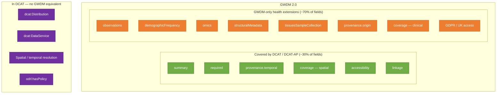
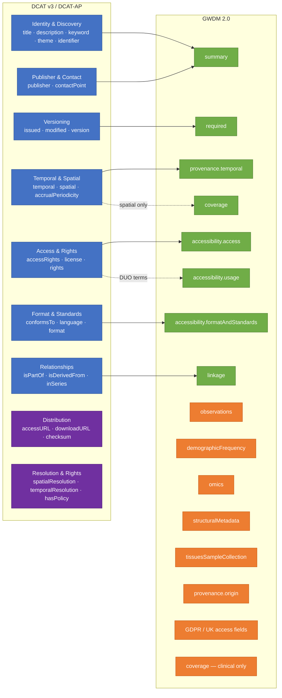

# DCAT ↔ GWDM 2.0 Mapping

This document compares the [W3C DCAT v3](https://www.w3.org/TR/vocab-dcat-3/) standard (and its [DCAT-AP v3](https://semiceu.github.io/DCAT-AP/releases/3.0.0/) application profile) with the Gateway Data Model (GWDM) version 2.0, identifying what is covered, what is missing in each direction, and how GWDM could be refactored as **DCAT + health-specific extensions**.

---

## Background

| Standard | Purpose |
|---|---|
| **DCAT v3** | W3C vocabulary for describing datasets and data services in data catalogs. Defines classes (`Dataset`, `Distribution`, `DataService`, `Catalog`) and properties drawn from Dublin Core, PROV-O, FOAF, and SKOS. |
| **DCAT-AP v3** | EU application profile of DCAT. Adds mandatory/recommended cardinalities and controlled vocabularies. Widely used across European open data portals and the European Health Data Space (EHDS). |
| **Health-DCAT-AP v6** | Dutch/EHDS extension of DCAT-AP for health datasets. Adds fields for personal data categories, legal basis, minimum/maximum age, population coverage. Implemented by [SeMPyRO](https://github.com/Health-RI/SeMPyRO). |
| **GWDM 2.0** | HDR UK Gateway Data Model. Rich metadata schema for UK health datasets. Extends beyond simple catalog metadata to include clinical cohort metadata, structural (table/column) metadata, biobank sample metadata, and UK-specific access/GDPR requirements. |

---

## Diagrams

### Overview — Coverage zones

GWDM 2.0 (outer box) is a superset of DCAT. The inner zones show which GWDM sections are covered by DCAT properties (green) versus which are GWDM-only health extensions (orange). The separate purple box shows DCAT/DCAT-AP concepts that have no equivalent in GWDM.



**Legend:** Green = DCAT-mapped GWDM sections &nbsp;·&nbsp; Orange = GWDM-only health extensions &nbsp;·&nbsp; Purple = DCAT features absent from GWDM

---

### Section-level mapping

Which DCAT concept groups map to which GWDM sections. Solid arrows = direct/strong mapping; dashed arrows = partial or approximate mapping. Orange nodes have no incoming DCAT arrow — they are GWDM-only.



**Legend:** Blue = DCAT properties &nbsp;·&nbsp; Green = GWDM sections with DCAT coverage &nbsp;·&nbsp; Orange = GWDM-only sections &nbsp;·&nbsp; Purple = DCAT features with no GWDM equivalent

---

## 1. DCAT Dataset → GWDM 2.0 Mapping

Every DCAT/DCAT-AP property for a `dcat:Dataset`, with the equivalent GWDM 2.0 field.

### Core identification & discovery

| DCAT property | Namespace | DCAT-AP cardinality | GWDM 2.0 equivalent | Notes |
|---|---|---|---|---|
| `title` | `dcterms:title` | Mandatory (1..*) | `summary.title` | Direct match |
| `description` | `dcterms:description` | Mandatory (1..*) | `summary.abstract` + `summary.description` | GWDM splits into short abstract and long description |
| `keyword` | `dcat:keyword` | Recommended | `summary.keywords` | GWDM uses comma-separated string; DCAT expects array of literals |
| `theme` | `dcat:theme` | Recommended | `summary.datasetType` | GWDM uses free CSV; DCAT expects controlled SKOS concept URIs |
| `identifier` | `dcterms:identifier` | Recommended | `required.gatewayId` + `required.gatewayPid` + `summary.doiName` | GWDM has three identifiers; DCAT allows multiple |
| `landingPage` | `dcat:landingPage` | Recommended | — | No GWDM equivalent; closest is `linkage.associatedMedia` |

### Provenance & versioning

| DCAT property | Namespace | DCAT-AP cardinality | GWDM 2.0 equivalent | Notes |
|---|---|---|---|---|
| `issued` | `dcterms:issued` | Recommended | `required.issued` | Direct match |
| `modified` | `dcterms:modified` | Recommended | `required.modified` | Direct match |
| `version` | `dcat:version` | Optional | `required.version` | Direct match (semver string) |
| `versionNotes` | `adms:versionNotes` | Optional | `required.revisions` (partial) | GWDM `revisions` is an array of prior version references, not freetext notes |
| `wasGeneratedBy` | `prov:wasGeneratedBy` | Optional | `provenance.origin.purpose` (partial) | DCAT uses PROV-O Activity; GWDM has a controlled vocabulary field |

### Publisher & contact

| DCAT property | Namespace | DCAT-AP cardinality | GWDM 2.0 equivalent | Notes |
|---|---|---|---|---|
| `publisher` | `dcterms:publisher` | Recommended | `summary.publisher` | GWDM has a nested `Organisation` object (name, contactPoint, memberOf, etc.) |
| `contactPoint` | `dcat:contactPoint` | Recommended | `summary.contactPoint` | GWDM uses an email string; DCAT uses a `vcard:Kind` |
| `creator` | `dcterms:creator` | Optional | — | No direct GWDM equivalent; `accessibility.usage.resourceCreator` is closest |

### Temporal & spatial coverage

| DCAT property | Namespace | DCAT-AP cardinality | GWDM 2.0 equivalent | Notes |
|---|---|---|---|---|
| `temporal` | `dcterms:temporal` | Optional | `provenance.temporal.startDate` + `endDate` | GWDM splits into two fields |
| `accrualPeriodicity` | `dcterms:accrualPeriodicity` | Optional | `provenance.temporal.accrualPeriodicity` | Direct match (controlled vocab differs slightly) |
| `spatial` | `dcterms:spatial` | Optional | `coverage.spatial` | GWDM uses geonames CSV; DCAT expects a `dcterms:Location` resource |
| `spatialResolutionInMeters` | `dcat:spatialResolutionInMeters` | Optional | — | No GWDM equivalent |
| `temporalResolution` | `dcat:temporalResolution` | Optional | — | No GWDM equivalent |

### Access & rights

| DCAT property | Namespace | DCAT-AP cardinality | GWDM 2.0 equivalent | Notes |
|---|---|---|---|---|
| `accessRights` | `dcterms:accessRights` | Optional | `accessibility.access.accessRights` | GWDM uses URL/text string; DCAT expects a `dcterms:RightsStatement` resource |
| `license` | `dcterms:license` | Optional | `accessibility.usage.dataUseLimitation` (partial) | GWDM uses DUO (Data Use Ontology) terms, which are more granular than a single license URI |
| `rights` | `dcterms:rights` | Optional | — | Not explicitly modelled in GWDM |
| `hasPolicy` | `odrl:hasPolicy` | Optional | — | GWDM has no formal ODRL policy; DUO strings are closest in spirit |

### Format & standards

| DCAT property | Namespace | DCAT-AP cardinality | GWDM 2.0 equivalent | Notes |
|---|---|---|---|---|
| `conformsTo` | `dcterms:conformsTo` | Optional | `accessibility.formatAndStandards.conformsTo` | Direct match |
| `language` | `dcterms:language` | Optional | `accessibility.formatAndStandards.languages` | Direct match |

### Relationships

| DCAT property | Namespace | DCAT-AP cardinality | GWDM 2.0 equivalent | Notes |
|---|---|---|---|---|
| `source` / `wasDerivedFrom` | `dcterms:source` / `prov:wasDerivedFrom` | Optional | `linkage.datasetLinkage.isDerivedFrom` | GWDM uses a `DatasetDescriptor` array |
| `isPartOf` | `dcterms:isPartOf` | Optional | `linkage.datasetLinkage.isPartOf` | Direct match in intent |
| `inSeries` | `dcat:inSeries` | Optional | `linkage.datasetLinkage.isMemberOf` | Closest equivalent |
| `relation` | `dcterms:relation` | Optional | `linkage.datasetLinkage.linkedDatasets` | Partial match |
| `distribution` | `dcat:distribution` | Optional | `accessibility.formatAndStandards.formats` (partial) | DCAT separates Distribution as a first-class object; GWDM has no `Distribution` concept — format/access info is embedded inline |

---

## 2. DCAT Distribution → GWDM 2.0 Mapping

DCAT treats each downloadable/accessible form of a dataset as a separate `dcat:Distribution` object. GWDM has no equivalent concept — distribution-level information is embedded directly in the dataset record.

| DCAT Distribution property | Namespace | GWDM 2.0 equivalent | Notes |
|---|---|---|---|
| `accessURL` | `dcat:accessURL` | `accessibility.access.accessService` (partial) | GWDM is a text description, not a URL |
| `downloadURL` | `dcat:downloadURL` | — | Not modelled in GWDM |
| `mediaType` | `dcat:mediaType` | `accessibility.formatAndStandards.formats` (partial) | GWDM uses a CSV of format names, not MIME types |
| `format` | `dcterms:format` | `accessibility.formatAndStandards.formats` | Closest equivalent |
| `byteSize` | `dcat:byteSize` | — | Not modelled |
| `checksum` | `spdx:checksum` | — | Not modelled |
| `license` | `dcterms:license` | `accessibility.usage.dataUseLimitation` | Same partial match as at Dataset level |
| `accessRights` | `dcterms:accessRights` | `accessibility.access.accessRights` | Same as Dataset level |
| `title` / `description` | `dcterms:` | — | Not modelled per-distribution in GWDM |
| `issued` / `modified` | `dcterms:` | `required.issued` / `required.modified` | GWDM has these only at dataset level |
| `conformsTo` | `dcterms:conformsTo` | `accessibility.formatAndStandards.conformsTo` | Same as Dataset level |
| `accessService` | `dcat:accessService` | `accessibility.access.accessService` | GWDM is a text description; DCAT is a `dcat:DataService` resource |
| `compressionFormat` | `dcat:compressionFormat` | — | Not modelled |

**Key structural gap:** DCAT's separation of `Dataset` from `Distribution` allows one dataset to have multiple distributions (e.g. CSV download, SPARQL endpoint, and FHIR API). GWDM flattens all of this into a single record, which means it cannot represent a dataset available in multiple formats without duplication.

---

## 3. GWDM 2.0 Fields with No DCAT Equivalent ("EXTRA" Layer)

These are the fields that make GWDM richer than DCAT and would form the **health-specific extension layer** in a DCAT + EXTRA architecture.

### Gateway operational metadata

| GWDM 2.0 field | Description |
|---|---|
| `required.gatewayPid` | Persistent identifier in HDR UK Gateway (128-bit UUID) |
| `required.revisions` | Array of prior version references with timestamps |
| `summary.shortTitle` | Abbreviated title for display in lists/cards |
| `summary.controlledKeywords` | Curated/approved subset of keywords |
| `summary.inPipeline` | Whether dataset is available or in processing pipeline |
| `summary.populationSize` | Summary cohort size integer |
| `summary.datasetSubType` | Sub-type classification beyond `datasetType` |
| `summary.funders` | Comma-separated list of funding organisations |

### UK health / GDPR-specific access fields

| GWDM 2.0 field | Description |
|---|---|
| `accessibility.access.accessRequestCost` | Cost model or pricing for data access |
| `accessibility.access.deliveryLeadTime` | Estimated processing time for access request |
| `accessibility.access.jurisdiction` | ISO country/region codes for legal jurisdiction |
| `accessibility.access.dataController` | GDPR-mandated data controller organisation |
| `accessibility.access.dataProcessor` | GDPR-mandated data processor organisation |
| `accessibility.access.accessServiceCategory` | Category: TRE/SDE, direct, open, varies |
| `accessibility.usage.dataUseRequirement` | DUO obligation terms (e.g. ethics approval, publication moratorium) |
| `accessibility.usage.resourceCreator` | Required citation/attribution organisation |
| `accessibility.formatAndStandards.vocabularyEncodingSchemes` | Ontologies used (OPCS4, ICD10, SNOMED, etc.) |

### Provenance (health-specific)

| GWDM 2.0 field | Description |
|---|---|
| `provenance.temporal.timeLag` | Lag between clinical event and data availability |
| `provenance.temporal.distributionReleaseDate` | Date of most recent data release |
| `provenance.origin.purpose` | Why data was originally collected (clinical care, research, etc.) |
| `provenance.origin.source` | How data was extracted (EPR, paper forms, etc.) |
| `provenance.origin.collectionSituation` | Setting of collection (primary care, secondary care, etc.) |
| `provenance.origin.imageContrast` | Imaging-specific: contrast agent used (Yes/No/Not stated) |

### Clinical/cohort coverage metadata

| GWDM 2.0 field | Description |
|---|---|
| `coverage.pathway` | Patient care pathway covered by dataset |
| `coverage.typicalAgeRange` | Age range of covered population (format: min-max) |
| `coverage.followUp` | Longitudinal follow-up period (0-6M, 6-12M, 1-10Y, >10Y, etc.) |
| `coverage.datasetCompleteness` | Link to dataset completeness information |

### Statistical observations

| GWDM 2.0 field | Description |
|---|---|
| `observations[].observedNode` | What is being counted: Persons, Events, Findings, Scans |
| `observations[].measuredValue` | The count or population size |
| `observations[].observationDate` | When the count was recorded |
| `observations[].disambiguatingDescription` | Free-text clarification |

### Demographic distributions (v2.0+)

| GWDM 2.0 field | Description |
|---|---|
| `demographicFrequency.age` | Array of age-band / count pairs (24 bins) |
| `demographicFrequency.ethnicity` | Array of ethnicity category / count pairs (18 categories) |
| `demographicFrequency.disease` | Array of ICD10/SNOMED/MeSH code / count pairs |

### Omics metadata (v2.0+)

| GWDM 2.0 field | Description |
|---|---|
| `omics.assay` | Assay type: WGS, RNA-seq, mass spectrometry, etc. |
| `omics.platform` | Platform: Illumina, Oxford Nanopore, etc. |

### Structural metadata (table/column schema)

| GWDM 2.0 field | Description |
|---|---|
| `structuralMetadata[].name` | Table name |
| `structuralMetadata[].description` | Table description |
| `structuralMetadata[].columns[].name` | Column name |
| `structuralMetadata[].columns[].dataType` | Column data type |
| `structuralMetadata[].columns[].sensitive` | Whether column is considered sensitive |
| `structuralMetadata[].columns[].values[]` | Enumerated allowed values with counts |

### Biobank / tissue sample metadata (MIABIS, v1.1+)

| GWDM 2.0 field | Description |
|---|---|
| `tissuesSampleCollection[].dataCategories` | MIABIS-2.0-13 data types |
| `tissuesSampleCollection[].materialType` | MIABIS-2.0-14 biospecimen types |
| `tissuesSampleCollection[].storageTemperature` | Storage temperature |
| `tissuesSampleCollection[].disease` | Associated diseases |
| `tissuesSampleCollection[].collectionType` | MIABIS-2.0-16 collection type |
| `tissuesSampleCollection[].tissueSampleMetadata` | Per-sample: donor, anatomical site, diagnosis, use restrictions |

### Linkage & publications

| GWDM 2.0 field | Description |
|---|---|
| `linkage.isGeneratedUsing` | Tools/methods used to generate dataset |
| `linkage.dataUses` | Dataset usage descriptions |
| `linkage.isReferenceIn` | Citations using this dataset as reference |
| `linkage.investigations` | Keystone papers and investigation links |
| `linkage.syntheticDataWebLink` | Synthetic version download links |
| `linkage.publicationAboutDataset` | DOIs of papers describing this dataset |
| `linkage.publicationUsingDataset` | DOIs of papers using this dataset |

---

## 4. DCAT Features Not in GWDM 2.0

| DCAT concept | What it provides | Impact on GWDM |
|---|---|---|
| `dcat:Distribution` as first-class object | Separate metadata per downloadable file/API | GWDM cannot represent one dataset with multiple distributions without duplication |
| `dcat:DataService` | API endpoint as catalogued resource | GWDM treats access service as a text field |
| `dcat:DatasetSeries` | Group of related datasets sharing temporal structure | Partially covered by `isMemberOf`, but not as a first-class object |
| `dcat:Catalog` / `dcat:CatalogRecord` | Catalog-level provenance (who registered, when) | Not modelled in GWDM |
| `dcat:spatialResolutionInMeters` | Spatial granularity of dataset | Not in GWDM |
| `dcat:temporalResolution` | Minimum time interval between data points | Not in GWDM |
| `odrl:hasPolicy` | Machine-readable rights expression (ODRL) | GWDM uses human-readable DUO strings |
| `spdx:checksum` | Cryptographic integrity hash per distribution | Not in GWDM |

---

## 5. Overlap with Health-DCAT-AP and SeMPyRO

[SeMPyRO](https://github.com/Health-RI/SeMPyRO) (v2.1.0, Oct 2025) is a Pydantic + RDF implementation of DCAT-AP v3 and Health-DCAT-AP v6. Health-DCAT-AP v6 adds the following on top of DCAT-AP:

| Health-DCAT-AP field | Closest GWDM 2.0 equivalent |
|---|---|
| `healthdcatap:minTypicalAge` | Part of `coverage.typicalAgeRange` |
| `healthdcatap:maxTypicalAge` | Part of `coverage.typicalAgeRange` |
| `healthdcatap:populationCoverage` | `coverage.spatial` (partially) |
| `healthdcatap:hasPersonalData` | `accessibility.access.dataController` (implies personal data) |
| `healthdcatap:hdab` | Health Data Access Body — no equivalent in GWDM |
| `dpv:hasLegalBasis` | No equivalent in GWDM (closest: `accessRights`) |
| `dpv:hasPersonalDataCategory` | No equivalent in GWDM |
| `healthdcatap:hasCodebook` | `structuralMetadata` (much richer in GWDM) |
| `healthdcatap:analysisCode` | No equivalent in GWDM |

Health-DCAT-AP would cover roughly **10–15% of GWDM's "EXTRA" layer** — primarily the age range and some access/GDPR fields. GWDM's clinical depth (omics, demographic distributions, tissue samples, table/column metadata, DUO terms) is well beyond what Health-DCAT-AP currently models.

---

## 6. Summary

| Dimension | Assessment |
|---|---|
| **DCAT coverage of GWDM** | ~30% of GWDM fields have a direct DCAT/DCAT-AP equivalent |
| **GWDM fields outside DCAT** | ~70% — primarily clinical, cohort, structural, and UK-operational metadata |
| **DCAT features GWDM lacks** | `Distribution` layer, `DataService`, spatial/temporal resolution, ODRL policy, checksum |
| **Health-DCAT-AP (SeMPyRO) gap** | Covers an additional ~10–15% of GWDM's extra layer; still misses omics, tissue samples, DUO, structural metadata |
| **GWDM = DCAT + EXTRA feasibility** | High — GWDM's structure already implicitly separates discovery-level metadata (mappable to DCAT) from health-specific extensions. A GWDM v3.0 could subclass a `DcatDataset` base model and add all current GWDM sections as optional extensions. |

### What GWDM does that DCAT does not

DCAT is a **catalog vocabulary** — it tells you a dataset exists, who owns it, where to get it, and what format it is. GWDM is a **rich health dataset descriptor** — it tells you what the data contains, who is in it, what clinical concepts are encoded, how it was collected, what you are allowed to do with it under UK law, and how to link it to other datasets. These are complementary, not competing, concerns.

The recommended architecture for a future GWDM version is:

```
GWDMDataset
  ├── [DCAT base]       title, description, publisher, contactPoint,
  │                     identifier, issued, modified, version,
  │                     spatial, temporal, accrualPeriodicity,
  │                     accessRights, language, conformsTo, license
  │
  └── [GWDM EXTRA]      coverage, provenance.origin, observations,
                        demographicFrequency, omics, structuralMetadata,
                        tissuesSampleCollection, linkage (extended),
                        GDPR fields, DUO terms, Gateway operational fields
```
